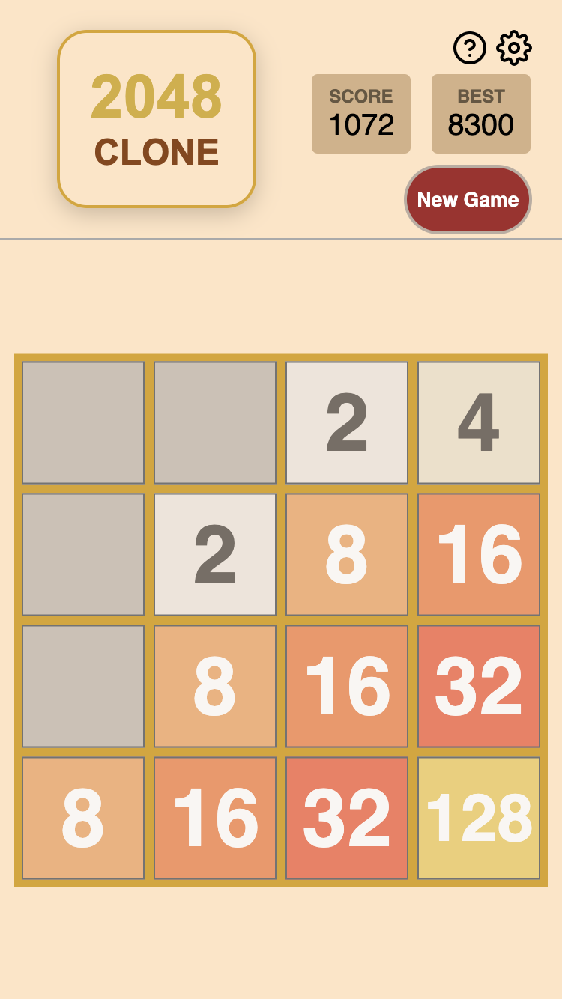

# 2048-clone

[](https://github.com/Coteh/2048-clone/actions/workflows/run-tests.yml)

### [**Click here to play**](https://coteh.github.io/2048-clone)

A clone of [2048](https://play2048.co/), and also a remake of my first side project on GitHub, [2048Clone](https://github.com/Coteh/2048Clone).



## Setup

### Browser

[Click here to play on the browser](https://coteh.github.io/2048-clone)

## Features

- Base game

## Development

Clone this repository, then run the following:

```
npm install
```

At this point, run the following to start a local dev server:

```sh
npm run dev
```

The game should render when navigating to http://localhost:5173.

### HTTPS Local Development

The share feature uses the share sheet provided by the browser/OS and can also fall back to the browser's clipboard feature if the share sheet isn't available. Both of these features need a secure context to operate, requiring the use of a local HTTPS server when developing them. However, the game can still run on a HTTP server, where it will default to legacy clipboard functionality.

Using [mkcert](https://github.com/FiloSottile/mkcert), run the following commands to setup local certificates to be used by local HTTPS server:

```sh
mkdir ssl
cd ssl

# run this on elevated shell on Windows
mkcert -install

mkcert localhost 127.0.0.1 ::1
```

Then run the following to start up the local HTTPS server:

```sh
npm run devs
```

The game should render when navigating to https://localhost:5173.

## Testing

Run the following to launch unit tests:

```
npm run test
```

Cypress tests can be accessed by running the following:

```
npm run cypress open
```

This will launch the tests in the Cypress UI. 

Alternatively, you can run the tests directly on CLI:

```
npm run cypress run
```
