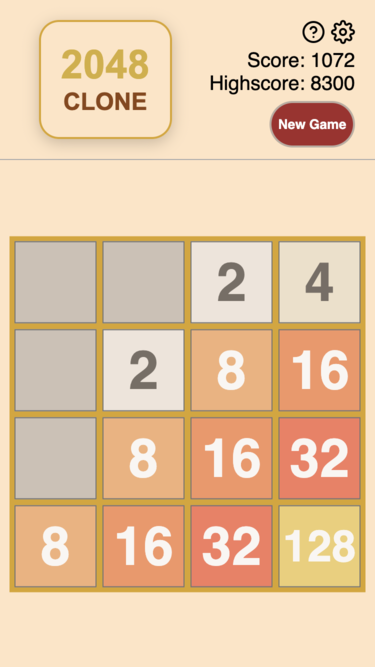

# 2048-clone

[](https://github.com/Coteh/2048-clone/actions/workflows/run-tests.yml)

### [**Click here to play**](https://coteh.github.io/2048-clone)

A clone of [2048](https://play2048.co/) created using vanilla JavaScript, HTML, and CSS. This was created as a throwback to my first side project on GitHub, [2048Clone](https://github.com/Coteh/2048Clone).



## Features

- Base game
- Animations, with ability to toggle them on/off
- Share score (using OS-native share sheet or copy to clipboard as fallback)
- Themes
    - Standard
    - Light
    - Dark
    - Snow
        - Includes the following tilesets:
            - Snow
            - Christmas
    - 2048Clone (unlock by achieving 2048 in any theme)
        - All tile color sets from 2048Clone return as tilesets for this theme:
            - Modern
            - Classic
            - Colorful
            - Initial Commit (unlock by achieving 2048 in 2048Clone theme)
- Block styles
    - Standard (default - blocks are relatively large)
    - Compact (blocks are smaller)
- Confetti animation when player achieves 2048 (using [canvas-confetti](https://github.com/catdad/canvas-confetti) library)
- Changelog Dialog
    - Shows the contents of [CHANGELOG.md](CHANGELOG.md) in a dialog box in-game
    - Uses [marked](https://github.com/markedjs/marked) to parse the changelog markdown file into HTML to be displayed in the dialog

## Development Setup

Clone this repository, then run the following:

```
npm install
```

At this point, run the following to start a local dev server:

```sh
npm run dev
```

The game should render when navigating to http://localhost:5173.

### HTTPS Local Development

The share feature uses the share sheet provided by the browser/OS and can also fall back to the browser's clipboard feature if the share sheet isn't available. Both of these features need a secure context to operate, requiring the use of a local HTTPS server when developing them. However, the game can still run on a HTTP server, where it will default to legacy clipboard functionality.

Using [mkcert](https://github.com/FiloSottile/mkcert), run the following commands to setup local certificates to be used by local HTTPS server:

```sh
mkdir ssl
cd ssl

# run this on elevated shell on Windows
mkcert -install

mkcert localhost 127.0.0.1 ::1
```

Then run the following to start up the local HTTPS server:

```sh
npm run devs
```

The game should render when navigating to https://localhost:5173.

## Testing

Run the following to launch unit tests:

```
npm run test
```

Cypress tests can be accessed by running the following:

```
npm run cypress open
```

This will launch the tests in the Cypress UI. 

Alternatively, you can run the tests directly on CLI:

```
npm run cypress run
```

## Future Improvements

### In-Progress Features

Features I started but have decided to cut for the initial release. Will come back and finish these whenever I feel like it.

- Undo feature
    - Currently partially implemented for debugging purposes
    - Enable debug mode when running locally to access
- Share Image feature ([share-image](https://github.com/Coteh/2048-clone/tree/share-image))
    - Allows player to share an image of their game board upon game over instead of just their score
    - Currently uses [html-to-image](https://github.com/bubkoo/html-to-image) to take a snapshot of the DOM to save as image that is then exported to share sheet

### Wishlist (Not Started)

- CLI interface
- Landscape mode
- Sound effects
